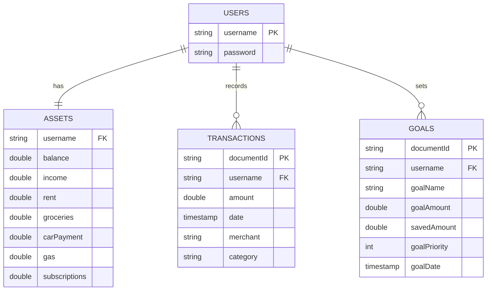
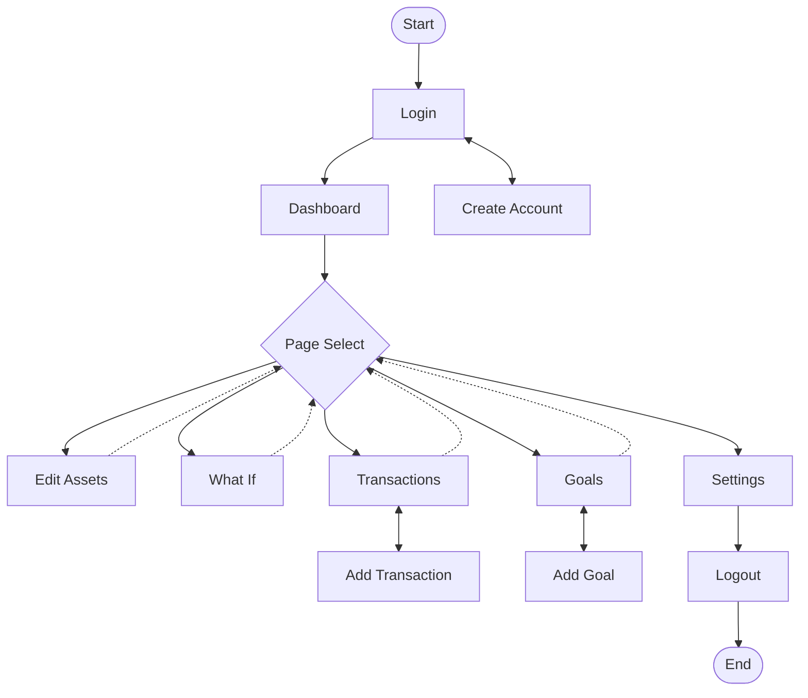

# Quick Links
[Getting Started](#getting-started) • [Data Security](#data-security) • [User Manual](#user-manual) • [Database Schema](#database-schema) • [Tech Stack](#technology-stack) • [Credits](#credits)

   

# Project Overview
This project is a budgeting app used to track monthly expenses, income, and current balance to calculate the net gain or loss per month. It is written in C# .NET 8 MVC architecture using HTML/CSS/JavaScript and jQuery for front-end design. Firebase is used for datastores and the application is hosted on Azure Web Apps.

# Features
### Interactive Dashboard
* Table, doughnut, and line chart views of your income and expenses by month or by year

### "What If" Hypothetical Calculator
* Make adjustments to your budget to play out hypothetical financial situations without affecting your actual database records

### Transaction Tracking
* Track your non-recurring transactions and apply filters to see if you are staying within or exceeding your budget

### Goal Tracking
* Track your financial goals, ordered by priority, see how close you are to reaching each goal, and how much you need to save per month to reach your goal on time

### User Experience  
* Delete your data or account at any time in the Settings menu or toggle between light and dark themes 

# Getting Started
The most recent publish may be viewed here: https://budgetingapp41674.azurewebsites.net  
  
Please note that this application is hosted on Azure using the free tier (F1), which has strict limitations. The app will likely have to cold start, which may take a while to start up, and is limited to 1 hour of usage per day. Therefore it may be possible
 that this limit has been exceeded and the app will no longer function until the daily limit resets. 
   
  You may create a new account to login to the application. Passwords are hashed, but please do no use any sensitive information regardless.

Alternatively, you may create your own Firebase and run the application locally. Using Visual Studio 2022, you can create a file publish by loading the project and navigating to Build > Publish BudgetingApp and creating a new profile for a file publish. Once the publish is created, you will have a .exe file that you can run after you have initialized your Firebase and configured your local environment variable. Once you run the .exe file, one of the lines will say "now listening on: http:localhost:xxxx. Copy this link (from http to the end of the line) and paste it into a web browser to interact with the application.

## Firebase Configuration
The backend of this application uses the Firebase Admin SDK, which requires a service account key for administrative access to your Firebase project. 

**Steps to set up your local Firebase Admin SDK credentials:**

1.  **Create a Firebase Project:**
    * Go to the [Firebase Console](https://console.firebase.google.com/).
    * Create a new Firebase project.

2.  **Generate a Service Account Key:**
    * In your Firebase project, go to **Project settings** > **Service accounts**.
    * Click "Generate new private key" and then "Generate Key".
    * A JSON file will be downloaded.

3.  **Securely Store the Key:**
    * Save this JSON file to a secure location on your local machine.
    * **Important:** Ensure this file is NOT inside your project's directory, or if it is temporarily for testing, make sure it's ignored by Git (`.gitignore`).

4.  **Set the `GOOGLE_APPLICATION_CREDENTIALS` Environment Variable:**
    Your application will look for this environment variable to find the service account key.

    * **Windows:**
        * Search for "Environment Variables" in Windows.
        * Click "Edit the system environment variables".
        * Click "Environment Variables..." button.
        * Under "User variables for [YourUser]", click "New...".
        * Variable name: `GOOGLE_APPLICATION_CREDENTIALS`
        * Variable value: `C:\path\to\your-service-account-file.json` (the full path to your downloaded JSON file)
        * Click OK on all dialogs.
          
5. **Create the Firestore**
   * In Firebase Console, go to project overview.
   * Scroll down if needed and click "Cloud Firestore".
   * Click "Create database".
   * Use default settings and press "Next".
   * Ensure "Start in production mode" is selected and press "Create".

Once you have set the environment variable and created a Firestore, you should now be able to run the application (BudegtingApp.exe) and copy/paste the localhost URL into your browser to use the application.

# Data Security
This application provides the following security measures to protect accounts and data:

* **Multi-Factor Authentication:** This project provides TOTP-based additional authentication via Otp.NET upon user opt-in
* **Password Hashing:** All user passwords are salted and hashed using BCrypt.Net-Next before being stored in Firestore
* **Session Management:** User sessions are handled securely through ASP.NET Core Identity/Cookies with explicit logout functionality to clear session data
* **Session Timeout:** Sessions expire after 15 minutes of inactivity and the user will be brought back to the login page
* **Data Control:** Users are able to delete their data or accounts at any time in the Settings menu
* **Environment Variables:** Database credentials are managed via environment variables and are never hard-coded

> [!WARNING]
> While these measures are in place, this is a portfolio project. Please do not use sensitive data.

# User Manual
Here we will walk through how to use the application
## Login Page

This is the landing page. You will be able to use your username and password to login to your account.

## Create Account

If you do not have an account, you can create one here.

## Dashboard

After you login, you will be taken to the Dashboard. Here you will find a read-only table that includes your overall balance, your income and expenses, and net gain or loss (income - expenses) per month and per year.
A Chart.js Doughnut Chart is provided to give a visual representation of your monthly expenses and a Line Chart displays your income, expenses, and net over the span of 12 months.
You may add or subtract money directly to or from the balance.

## Edit Expenses

Here you may set your balance, income, and expenses. Once you have set the values you want, press submit and you will automatically be redirected to the Dashboard.

## What If

What If is designed to be a hypothetical situation calculator. You may edit your balance, income, and expenses in the table and your total expenses and net will automatically update with each keystroke. 
None of the input data here will be saved to the database, so there is no need to revert any changes.

## Transactions

Transactions are a way to visualize and keep track of non-recurring charges. Here you will see a list of all manually-entered transactions consisting of the transaction date, the merchant name, transaction category, and the amount cost. 
You will also see your budgeted vs actual expenses based on your transaction history to help you see if you are staying within or exceeding your budget for each category.

### Add Transaction

You may add a new transaction by entering the date, merchant name, transaction category, and amount cost. The amount will automatically be deducted from your balance.

## Goals

The goals page is used for setting financial goals to track your progress toward each goal. You can set the name, amount, target date, priority, and amount already saved and the application will calculate the amount needed to save each month to hit the goal on time and the percentage progress.

### Add Goal

Here you can add financial goal by inputting the name, amount, target date, priority, and amount already saved. 

### Edit Goal

Here you can edit a selected goal's name, amount, target date, priority, and amount already saved.

## Settings

Here you will find your account settings. You may change your password or logout of your account. If you choose to logout, your session will be deleted and you will be redirected to the Login page.

### Setup MFA

Here you may scan the QR code or enter the generated code into an authenticator app to link and enable Multi-Factor Authentication via Timed One Time Password (note that the code in the screenshot is for an account that does not exist).

### Dark Theme

This is what the application looks like in dark mode. You may toggle between light and dark mode using the pill selector. Your selection will be saved to your browser's local storage for persistence.

# Database Schema

# Flowchart

Here is a basic flowchart for the application in the primary scenario.

# Technology Stack
This application is written in C# using .NET 8 MVC architecture for back-end design and HTML/CSS and JavaScript using jQuery for front-end design. The project is coded in Visual Studio Community 2022 on a Windows 10 machine. NuGet packages BCrypt.Net-Next (for hashing passwords) and Google.Cloud.Firestore (for interacting with the Firebase) are necessary to build the project. The database is a No-SQL Cloud Firestore and the project is hosted on Azure Web Apps.

| Component | Technology | Purpose |
| :---: | :----: | :---: |
| Backend | .NET 8 MVC | Core Logic & Routing |
| Database | Firestore | NoSQL Document Storage |
| Security | BCrypt.Net | Credential Hashing |
| Charts | Chart.js | Visual Expense Tracking |
| Hosting | Azure Web Apps | Cloud Deployment |

# Planned Features/To-Do list
* Bulk add/delete transactions
* Add "Savings" to transactions
* Add error message when adding or subtracting non-number from balance
* Custom categories
* Highlight interactable boxes in What-If
* Add account creation message
* Currency conversion calculator
* Export/Import transactions via Excel
* Unit tests
* Refactor logic in controllers to corresponding services

# Credits
This project relies on the following open-source libraries:
* **[Otp.NET](https://github.com/kspearrin/Otp.NET):** Multi-factor authentication (TOTP) implementation by [@kspearrin](https://github.com/kspearrin)
* **[BCrypt.Net-Next](https://github.com/BcryptNet/bcrypt.net):** Modern password hashing by [@ChrisMcKee](https://github.com/ChrisMcKee), based on the work of Ryan D. Emerle and Damien Miller
* **[QRCoder](https://github.com/Shane32/QRCoder):** QR code generator by [@Shane32](https://github.com/Shane32/QRCoder)
